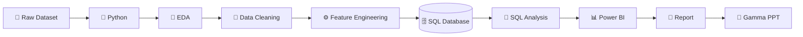

# 🛍️ Customer Shopping Behavior Analysis

<p align="center">
  <b>End-to-End Data Analytics Project | Python • SQL • Power BI</b>
</p>

<p align="center">
  
  
  
  
  
  
</p>

---

## Overview

This project analyzes **customer shopping behavior** to understand purchasing patterns, customer segments, product preferences, discount usage, subscriptions, and revenue trends.

The project follows a complete data analytics workflow:

**Raw Data → Python EDA & Cleaning → SQL Database → SQL Analysis → Power BI Dashboard → Report → Presentation**

The goal is to turn raw customer transaction data into clear, business-friendly insights that can support better marketing, customer retention, product, and sales decisions.

---

## Dataset

The dataset contains **3,900 customer records** with **18 original columns**.

Key fields include:

- Customer ID
- Age
- Gender
- Item Purchased
- Category
- Purchase Amount
- Location
- Season
- Review Rating
- Subscription Status
- Shipping Type
- Discount Applied
- Previous Purchases
- Payment Method
- Purchase Frequency

During data preparation, additional analytical features such as **Age Group** and **Purchase Frequency Days** are created.

---

## Tools & Technologies

| Tool | Purpose |
|---|---|
| **Python** | Data loading, EDA, cleaning, and transformation |
| **Pandas** | Data manipulation and feature engineering |
| **Jupyter Notebook** | Interactive analysis workflow |
| **PostgreSQL** | Main relational database used for SQL analysis |
| **MySQL** | Alternative database-loading example |
| **SQL Server** | Alternative database-loading example |
| **SQL** | Business-question analysis and segmentation |
| **Power BI** | Interactive dashboard and KPI visualization |
| **Gamma** | Presentation / project storytelling |
| **GitHub** | Project documentation and version control |

---

## Project Steps



### 1. Load the Dataset

The CSV dataset is loaded into Python using Pandas.

```python
import pandas as pd

df = pd.read_csv("customer_shopping_behavior.csv")
```

### 2. Exploratory Data Analysis

The dataset is explored to understand:

- Shape and structure
- Data types
- Missing values
- Numerical distributions
- Customer demographics
- Product categories
- Purchase behavior
- Subscription and discount patterns

### 3. Data Cleaning

The notebook performs practical cleaning tasks including:

- Checking null values
- Filling missing review ratings using the **median rating by product category**
- Standardizing column names to `snake_case`
- Renaming purchase amount for easier SQL use
- Removing the redundant `promo_code_used` column

### 4. Feature Engineering

Two useful analytical features are created:

- **Age Group** — groups customers into age-based segments
- **Purchase Frequency Days** — converts purchase-frequency labels into numeric day values

### 5. Load Data into SQL

The cleaned dataset is loaded into a relational database as a `customer` table.

The notebook includes connection examples for:

- PostgreSQL
- MySQL
- SQL Server

> For security, database passwords should be stored in environment variables rather than directly in the notebook.

### 6. SQL Analysis

SQL is used to answer business questions such as:

- Which gender generates more revenue?
- Which customers receive discounts while spending above average?
- Which products have the highest average ratings?
- How do Standard and Express shipping customers compare?
- How do subscribers and non-subscribers differ?
- Which products have the highest discount rate?
- How many customers are New, Returning, or Loyal?
- What are the top 3 products in each category?
- How many repeat buyers are subscribers?
- Which age groups generate the most revenue?

SQL concepts demonstrated include:

`GROUP BY` • `SUM()` • `AVG()` • `COUNT()` • `CASE` • Subqueries • CTEs • `ROW_NUMBER()` • Window Functions

---

## Dashboard

The cleaned and analyzed data is visualized in **Power BI** to provide an executive-friendly view of customer behavior.

The dashboard is designed to highlight areas such as:

- Revenue performance
- Customer demographics
- Customer segmentation
- Product performance
- Subscription behavior
- Purchase frequency
- Discount usage
- Shipping preferences

### Dashboard Preview

<p align="center">
  
</p>

> Add your exported Power BI screenshot as `docs/dashboard-overview.png` to display it here.

The Power BI source file is included in the repository:

```text
Customer_Behavior_DashBoard.pbix
```

---

## Results

The analysis provides a structured view of customer purchasing behavior and helps identify:

- Revenue contribution across customer groups
- Differences between subscribed and non-subscribed customers
- High-performing products and categories
- Products with stronger discount dependency
- Repeat-purchase behavior
- Customer loyalty segments
- Spending patterns across age groups
- Shipping and purchase-frequency preferences

These findings can support business decisions in **customer retention, promotions, product strategy, targeting, and sales planning**.

> Detailed values can be explored directly through the SQL queries and Power BI dashboard.

---

## Report & Presentation

The final project can be presented in two business-friendly formats:

**Analytics Report**
- Project objective
- Data preparation process
- SQL findings
- Dashboard insights
- Business recommendations

**Gamma Presentation**
- Problem statement
- Dataset overview
- Analysis workflow
- Key visuals
- Major insights
- Recommendations
- Conclusion

This makes the project suitable for both **technical review and stakeholder presentation**.

---

## Repository Structure

```text
customer_behavior_analysis/
│
├── Customer_Shopping_Behavior_Analysis.ipynb
│   └── Python EDA, cleaning, feature engineering & database loading
│
├── customer_shopping_behavior.csv
│   └── Raw customer shopping dataset
│
├── customer_behavior_sql_queries.sql
│   └── Business analysis SQL queries
│
├── Customer_Behavior_DashBoard.pbix
│   └── Power BI dashboard
│
└── README.md
    └── Project documentation
```

---

## How to Run

### 1. Clone the Repository

```bash
git clone https://github.com/JaadiMalik/customer_behavior_analysis.git
cd customer_behavior_analysis
```

### 2. Create a Virtual Environment

```bash
python -m venv .venv
```

Activate on Windows:

```bash
.venv\Scripts\activate
```

Activate on macOS/Linux:

```bash
source .venv/bin/activate
```

### 3. Install Dependencies

```bash
pip install pandas jupyter sqlalchemy psycopg2-binary
```

For optional database connections:

```bash
pip install pymysql pyodbc
```

### 4. Run the Notebook

```bash
jupyter notebook Customer_Shopping_Behavior_Analysis.ipynb
```

### 5. Configure the Database

Create a database and update your local database connection settings.

Recommended approach:

```python
import os
from sqlalchemy import create_engine

username = os.getenv("DB_USER")
password = os.getenv("DB_PASSWORD")
host = os.getenv("DB_HOST", "localhost")
port = os.getenv("DB_PORT", "5432")
database = os.getenv("DB_NAME")

engine = create_engine(
    f"postgresql+psycopg2://{username}:{password}@{host}:{port}/{database}"
)
```

### 6. Run the SQL Queries

After the cleaned data is loaded into the `customer` table, execute:

```text
customer_behavior_sql_queries.sql
```

### 7. Open the Power BI Dashboard

Open:

```text
Customer_Behavior_DashBoard.pbix
```

in **Power BI Desktop**.

If required, update the database connection under Power BI Data Source Settings.

---

## Skills Demonstrated

- Exploratory Data Analysis
- Data Cleaning
- Data Transformation
- Feature Engineering
- SQL Querying
- PostgreSQL / MySQL / SQL Server Integration
- Customer Segmentation
- Business KPI Analysis
- Power BI Dashboard Development
- Data Storytelling
- Business Reporting
- Presentation Development

---

## Key Project Value

This project demonstrates the ability to work across the **full analytics lifecycle** rather than only creating charts:

> **Prepare data → analyze it → query it → visualize it → communicate the results.**

That makes the project relevant for roles such as:

**Data Analyst • Business Analyst • BI Analyst • Reporting Analyst • Junior Analytics Engineer**

---

## Author

**Jaadi Malik**

GitHub: [@JaadiMalik](https://github.com/JaadiMalik)

---

⭐ If you found this project useful, consider starring the repository.
